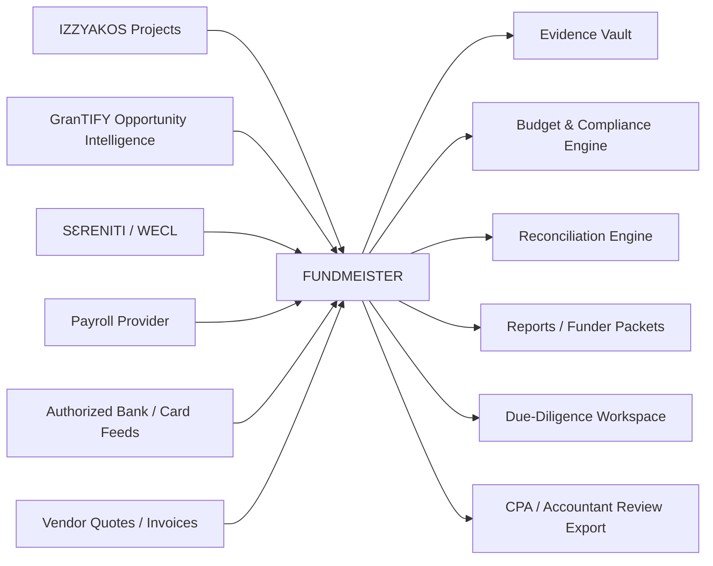

# FUNDMEISTER — Company-Wide Financial Stewardship Foundation

Status: implementation baseline
Date: 2026-09-23
Owner: IZZYAKOS LLC
Parent ecosystem: GranTIFY
Pilot tenant: BOAMAN

## Product definition

FUNDMEISTER is the financial stewardship, funding intelligence, partnership, sponsorship, budget-control, and evidence layer for IZZYAKOS LLC projects. It is invoked by default when a project is created. GranTIFY discovers and qualifies funding; FUNDMEISTER turns a selected opportunity or capital source into a governed ledger with defensible sources-and-uses, restrictions, approvals, transactions, evidence, reconciliation, reporting, and closeout.

Core invariant: **Every material dollar has provenance.**

FUNDMEISTER does not replace a bank, payment processor, payroll provider, CPA, auditor, attorney, or tax authority. It orchestrates evidence and controls around authorized data from those systems.

## Ubiquitous company contract

Every IZZYAKOS project receives a FUNDMEISTER project record with:

- project identity, department, owner, lifecycle state, and cost centers;
- funding-readiness profile and opportunity filters;
- funding/partnership/sponsorship pipeline;
- approved and scenario budgets;
- vendor/working-capital assumptions with source evidence;
- funding-source ledger and restrictions;
- transaction/reconciliation queue;
- invoice/receipt/contract/evidence vault references;
- reimbursement and mileage ledgers;
- WECL allocation references;
- payroll allocation references;
- reporting obligations and deadlines;
- immutable audit/change events;
- sources-and-uses, budget-v-actual, runway, and funder packet views.

## System context

## Canonical domains

1. Organization and projects
2. Funding opportunities
3. Funding applications
4. Partnerships and sponsorships
5. Funding sources / awards / capital
6. Budgets and budget versions
7. Cost assumptions and vendor evidence
8. Financial accounts and provider sync state
9. Transactions and transfer matching
10. Expense allocations
11. Receipts, invoices, contracts, and evidence
12. Reimbursements and mileage
13. WECL labor allocations
14. Payroll allocations
15. Restrictions and compliance rules
16. Reporting obligations
17. Alerts, exceptions, reviews, and approvals
18. Audit events and immutable provenance

## State machines

### Opportunity
discovered -> screened -> needs-evidence -> eligible -> pursuing -> submitted -> decision-pending -> awarded | declined | withdrawn | expired

### Funding source
planned -> approved -> received -> active -> restricted-hold | active -> exhausted -> reporting -> closed

### Transaction
ingested -> unmatched -> proposed-allocation -> evidence-missing | review-required -> reconciled -> locked
Corrections create a reversing/correcting event; they do not erase provenance.

### Evidence
captured -> linked -> verified-metadata -> accepted-for-review | rejected/insufficient -> superseded

## GranTIFY -> FUNDMEISTER contract

GranTIFY sends:
- opportunity ID and source URL;
- sponsor/funder;
- program and capital type;
- deadline;
- eligibility rules;
- award range;
- allowable/prohibited uses when known;
- required documents;
- confidence/freshness timestamps.

FUNDMEISTER returns:
- pursue/hold/reject decision record (human-authorized);
- evidence gap list;
- scenario budget and source-backed cost assumptions;
- application checklist;
- post-award ledger if successful;
- reporting calendar;
- use-of-funds packet.

## WECL / payroll contract

WECL provides defensible human-work records: person, project, activity class, timestamp/window, duration, evidence reference, approval state. AI/tool runtime is never human labor.

Payroll provides compensation, employer-tax, benefit, deduction, and payment records.

FUNDMEISTER maps authorized labor/payroll records to project, department, cost center, funding source, budget category, restriction, and reporting period. It never invents a payroll event from WECL time.

## Security model

- tenant + project scoped authorization;
- least privilege and separation of duties;
- financial account tokens stay with the regulated/provider integration boundary;
- no service-role secrets in browser clients;
- RLS on exposed Supabase tables;
- authorization roles stored in protected application metadata/tables, never user-editable metadata;
- immutable append-only audit events for financial changes;
- evidence object hashes/version references;
- redaction layer for funder/auditor views;
- public diligence views contain no raw bank account data;
- simulated/demo data must be visibly labelled.

## Initial RBAC

| Capability | Founder/Admin | Finance | Project Manager | Contributor | Bookkeeper | CPA | Auditor/Funder |
|---|---|---|---|---|---|---|---|
| Project financial profile | RW | RW | R | - | R | R | scoped R |
| Funding pipeline | RW | RW | RW | - | R | R | scoped R |
| Budgets | approve/RW | RW | propose/R | - | R | R | scoped R |
| Transactions | R | RW | scoped R | own expenses | RW | R | scoped R |
| Evidence | R | RW | scoped RW | own upload | RW | R | scoped R |
| Reconciliation | approve | RW | - | - | RW | R | R |
| Compliance override | approve | propose | - | - | propose | review | review |
| Audit log | R | R | scoped R | own actions | R | R | scoped R |

## BOAMAN pilot

BOAMAN is the first tenant because it has a near-term capital-readiness need and a live Supabase/Vercel stack.

Pilot outputs:
- capital/funding opportunity board;
- evidence-gap board;
- 90-day use-of-funds scenario;
- source-backed cost assumptions;
- application/deadline tracker;
- founder-paid expense/reimbursement register;
- grant/funding-source ledger;
- sources-and-uses packet;
- investor/funder diligence packet;
- WECL/payroll allocation interface contract.

Public BOAMAN pages may expose approved summaries only. Raw finance data remains staff-only.

## 30 / 60 / 90

### Day 0-30
- canonical schema and RLS tests;
- BOAMAN staff-only pilot;
- manual opportunity ingestion;
- scenario budgets and vendor evidence;
- manual transaction/import workflow;
- evidence matching;
- sources-and-uses report.

### Day 31-60
- GranTIFY opportunity ingestion contract;
- bank-feed provider evaluation and read-only connection;
- transaction matching and transfers;
- receipt automation;
- reporting deadlines/alerts;
- accountant collaboration view.

### Day 61-90
- payroll and WECL allocation imports;
- restricted-fund rules engine;
- anomaly/duplicate detection;
- funder read-only packet;
- audit export;
- multi-project rollout to CHOPX, MyAccraIntMarket, TRACEBridge, Pantryster, HelioStack and other active projects.

## Product-truth gates

Do not claim:
- an account is connected until provider authorization and sync are verified;
- a transaction exists until it is ingested from an authorized source or explicitly entered as a manual record;
- an expense is allowable until rules/evidence support it;
- a grant is won until an award is documented;
- tax treatment or savings without qualified review where required;
- live/real-time sync where the provider is periodic.

## Immediate implementation decision

FUNDMEISTER is a central company capability, not duplicated code in every project. Each project integrates through a project/tenant contract. BOAMAN is a test tenant, not the permanent home of FUNDMEISTER.
